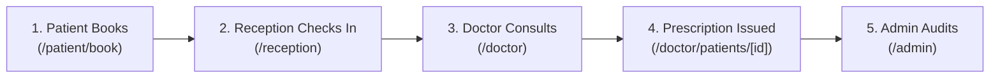

# Medicare HMS — Quick Start & Presentation Guide

A step-by-step quick guide for evaluators, faculty presentations, and rapid local setup of the **Medicare Hospital Management System** (Java 21 Spring Boot 3 + Next.js 16 + PostgreSQL).

---

## ⚡ 1. Rapid Launch (60-Second Setup)

### Current Live Status
If you already ran the startup commands, both services are actively running:
* **Frontend Portal**: [http://localhost:3000](http://localhost:3000)
* **Backend REST API**: [http://localhost:8080/api](http://localhost:8080/api)
* **Web Database Console**: [http://localhost:8080/h2-console](http://localhost:8080/h2-console)

### Starting Fresh from Terminal
If the services are stopped, run these two commands in separate terminal windows:

#### Terminal 1 — Start Java Spring Boot Backend:
```powershell
cd backend
mvn spring-boot:run
```
*(Backend initializes on `http://localhost:8080`, seeds demo accounts, and prepares the database)*

#### Terminal 2 — Start Next.js React Frontend:
```powershell
npm run dev
```
*(Frontend launches on `http://localhost:3000` and automatically proxies `/api/*` to the Java backend)*

---

## 🔑 2. Instant Login & Demo Credentials

Password for **all demo accounts**: **`Password@123`**

| Role | Email | Direct URL | Key Features to Test |
| :--- | :--- | :--- | :--- |
| **Administrator** | `admin@medicarehospital.in` | [/admin](http://localhost:3000/admin) | Hospital metrics, Doctor list, Department management, System audit log |
| **Doctor** | `doctor1@medicarehospital.in` | [/doctor](http://localhost:3000/doctor) | Daily OPD queue, Status transitions, Clinical notes, Digital prescriptions |
| **Patient** | `patient@example.com` | [/patient](http://localhost:3000/patient) | Doctor appointment booking, Slot picker, Prescriptions, Health card |
| **Receptionist** | `reception@medicarehospital.in` | [/reception](http://localhost:3000/reception) | Hospital-wide daily queue, Patient check-in, Walk-in OPD registration |

---

## 🩺 3. Step-by-Step Evaluator Demo Flow

Follow this 5-minute walkthrough to showcase the complete healthcare lifecycle:



### Step 1: Book an Appointment (Patient)
1. Go to [http://localhost:3000/login](http://localhost:3000/login) and log in as `patient@example.com` (`Password@123`).
2. Click **"Book Appointment"** or go to [http://localhost:3000/patient/book](http://localhost:3000/patient/book).
3. Select a department (e.g., **Cardiology** or **General Medicine**).
4. Pick a doctor (e.g., **Dr. Suresh Nair**) and choose an available consultation date & time slot.
5. Enter symptoms (e.g., *"Routine cardiovascular checkup"*) and submit.
6. Notice the confirmation screen with the generated **Queue Token** (e.g., `A-001`).

### Step 2: Patient Check-In (Receptionist)
1. Log out, then log in as `reception@medicarehospital.in` (`Password@123`).
2. Navigate to [http://localhost:3000/reception](http://localhost:3000/reception).
3. Look at today's hospital queue.
4. Locate the newly booked patient and click **"Check In"**. The status updates from `CONFIRMED` &rarr; `CHECKED_IN`.

### Step 3: Conduct Consultation & Issue Prescription (Doctor)
1. Log out, then log in as `doctor1@medicarehospital.in` (`Password@123`).
2. Go to [http://localhost:3000/doctor](http://localhost:3000/doctor).
3. Under today's consultations, click **"Start Consultation"**. Status changes to `IN_CONSULTATION`.
4. Click **"View Records"** to open the patient's medical file:
   - Enter **Diagnosis**: e.g., *"Mild hypertension, sinus rhythm normal"*.
   - Enter **Clinical Notes**: e.g., *"Advised low-sodium diet and 30-min daily walking"*.
   - Add **Prescription Medicine**: e.g., *"Amlodipine 5mg - 1 tablet daily morning for 30 days"*.
5. Click **"Save Consultation & Complete"**. The status transitions to `COMPLETED`.

### Step 4: Patient Views Digital Prescription (Patient)
1. Log back in as `patient@example.com`.
2. Visit [http://localhost:3000/patient](http://localhost:3000/patient) and [http://localhost:3000/patient/appointments](http://localhost:3000/patient/appointments).
3. Open the completed appointment to inspect the diagnosis and digitally generated prescription.

### Step 5: Executive Analytics & Audit Trail (Admin)
1. Log in as `admin@medicarehospital.in`.
2. Navigate to [http://localhost:3000/admin](http://localhost:3000/admin).
3. View real-time aggregated metrics:
   - Total Patients, Doctors, Departments, and Daily Appointments.
   - Status Breakdown Chart (Confirmed, Checked-in, Completed).
   - 7-day appointment trend analysis.
4. Review the **System Audit Log** recording authentication, bookings, and state changes.

---

## 🗄️ 4. Visual Database Inspection (H2 Console)

To inspect the underlying relational database in real time:

1. Open **[http://localhost:8080/h2-console](http://localhost:8080/h2-console)** in your browser.
2. Enter the following connection parameters:
   - **JDBC URL**: `jdbc:h2:file:./data/medicare_hms`
   - **User Name**: `sa`
   - **Password**: *(leave blank)*
3. Click **Connect**.
4. Run sample queries:
   ```sql
   -- View all users and encrypted BCrypt passwords
   SELECT id, full_name, email, role, is_active FROM users;

   -- View today's appointments and current status
   SELECT id, token_number, appointment_date, start_time, status, type FROM appointments;

   -- View hospital audit trail
   SELECT created_at, action, entity_type, details FROM audit_logs ORDER BY created_at DESC;
   ```

---

## 🐳 5. Production Docker Deployment (1 Command)

To run the entire system in isolated production containers (PostgreSQL 16 + Spring Boot 3 + Next.js 16):

```bash
# 1. Copy production environment file
cp .env.production.example .env

# 2. Build and launch containers
docker compose up --build -d

# 3. View status
docker compose ps
```

The production system will be available at:
* Frontend: `http://localhost:3000`
* Spring Boot REST API: `http://localhost:8080`
* PostgreSQL: `localhost:5432`

To shut down containers:
```bash
docker compose down
```

---

## 🛠️ 6. Troubleshooting & Diagnostics

| Issue | Cause | Solution |
| :--- | :--- | :--- |
| **Port 8080 in use** | An earlier Java process is still running | Find and kill PID: `netstat -ano \| findstr 8080` then `taskkill /F /PID <PID>` |
| **Port 3000 in use** | A Next.js process is active | Find and kill PID: `netstat -ano \| findstr 3000` then `taskkill /F /PID <PID>` |
| **"Invalid credentials"** | Incorrect password entered | Use `Password@123` (case-sensitive) |
| **H2 Console connection error** | JDBC URL typo | Ensure JDBC URL is exactly `jdbc:h2:file:./data/medicare_hms` with user `sa` |
| **Backend compilation error** | JDK version mismatch | Verify Java 21: `java -version` and `mvn -version` |
