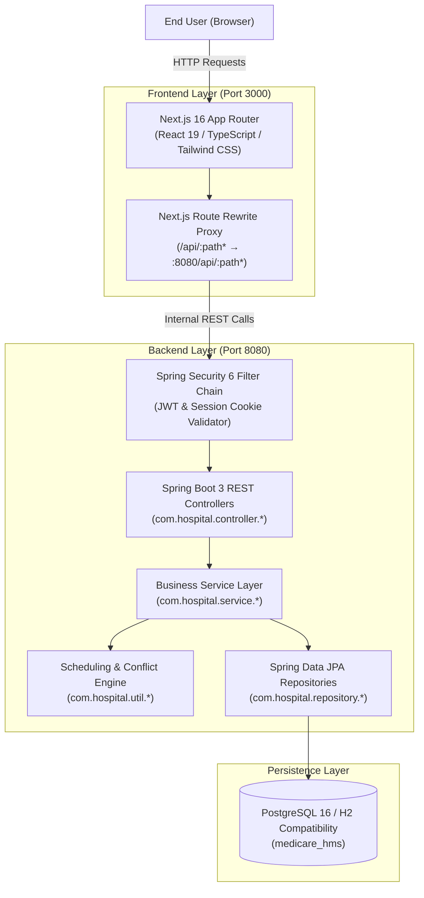
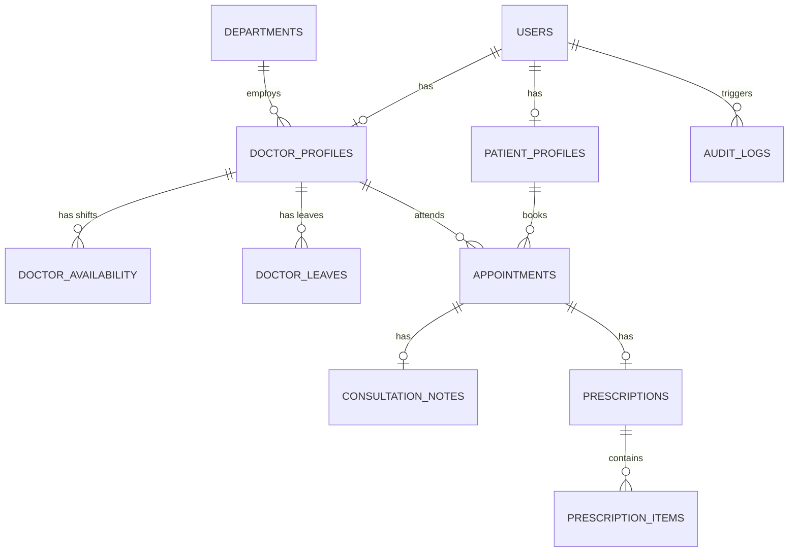

# Medicare Hospital Management System (HMS)

[](https://openjdk.org/)
[](https://spring.io/projects/spring-boot)
[-black?style=for-the-badge&logo=next.js&logoColor=white)](https://nextjs.org/)
[](https://www.postgresql.org/)
[](https://www.docker.com/)

A modern, enterprise-grade hospital management and outpatient appointment booking platform designed for **Medicare Hospital, Irinjalakuda, Kerala**. The system facilitates the entire outpatient care continuum — online slot booking, real-time reception queue management, doctor consultations, digital prescriptions, and executive analytics.

> [!NOTE]
> **Faculty & Academic Architecture Migration**:
> As per academic requirements, the backend architecture has been completely migrated from Node.js API routes to a clean, layered **Java 21 + Spring Boot 3.x** RESTful backend with **PostgreSQL**, **Spring Security 6**, and **Spring Data JPA**, while fully preserving the **Next.js React frontend**.

---

## 📑 Table of Contents
1. [System Architecture](#1-system-architecture)
2. [Technology Stack](#2-technology-stack)
3. [Layered Backend Structure (`com.hospital`)](#3-layered-backend-structure-comhospital)
4. [REST API Endpoint Catalog](#4-rest-api-endpoint-catalog)
5. [Database Architecture & Entities](#5-database-architecture--entities)
6. [Security & Authentication](#6-security--authentication)
7. [Demo Accounts & User Matrix](#7-demo-accounts--user-matrix)
8. [Getting Started & Local Execution](#8-getting-started--local-execution)
9. [Automated Testing Suite](#9-automated-testing-suite)
10. [Production Docker & Cloud Hosting](#10-production-docker--cloud-hosting)
11. [Quick Links & Documentation](#11-quick-links--documentation)

---

## 1. System Architecture

The application adopts a decoupled client-server architecture with an internal reverse-proxy pattern:



---

## 2. Technology Stack

### Backend
* **Language & Runtime**: Java 21 (LTS)
* **Framework**: Spring Boot 3.4.3
* **Security**: Spring Security 6, JJWT 0.12.6, BCrypt Password Encoder (12 rounds)
* **Data Access & ORM**: Spring Data JPA, Hibernate 6.6
* **Database Driver**: PostgreSQL Driver & H2 Database (PostgreSQL mode for local dev)
* **Validation**: Jakarta Bean Validation (`@Valid`, Hibernate Validator)
* **Build & Dependency Tool**: Apache Maven 3.9+
* **Productivity**: Project Lombok

### Frontend
* **Framework**: Next.js 16 (App Router)
* **Library**: React 19
* **Language**: TypeScript 5
* **Styling**: Tailwind CSS 4
* **Icons**: Lucide React
* **Client Architecture**: Server-Side Rendering (SSR) + Client Components + Next.js Standalone Build

---

## 3. Layered Backend Structure (`com.hospital`)

```
backend/src/main/java/com/hospital
├── HospitalApplication.java          # Spring Boot Application Entry Point
├── config/
│   ├── CorsConfig.java               # Global CORS configuration
│   └── DataInitializer.java          # Automatic demo database seeding
├── controller/
│   ├── AdminController.java          # Executive metrics and audit logs
│   ├── AppointmentController.java    # Shared appointment endpoints
│   ├── AuthController.java           # JWT login, register, me, logout
│   ├── DepartmentController.java     # Hospital department operations
│   ├── DoctorController.java         # Consultation, slots, and medical records
│   ├── PatientController.java        # Patient booking, rescheduling, and profile
│   └── ReceptionController.java     # Queue management and walk-in OPD
├── dto/                              # 25 strongly typed request/response records
│   ├── AppointmentDto.java
│   ├── ConsultationNoteDto.java
│   ├── CreateAppointmentRequest.java
│   ├── DoctorDto.java
│   ├── LoginRequest.java
│   ├── LoginResponse.java
│   ├── PrescriptionDto.java
│   └── ...
├── entity/                           # JPA Hibernate relational entities
│   ├── Appointment.java              # Appointments with tokens and state
│   ├── AppointmentStatus.java        # REQUESTED, CONFIRMED, CHECKED_IN, etc.
│   ├── AppointmentType.java          # ONLINE, IN_PERSON, FOLLOW_UP, EMERGENCY
│   ├── AuditLog.java                 # Security and operation audit trail
│   ├── ConsultationNote.java         # Clinical diagnoses and findings
│   ├── Department.java               # Medical specialty departments
│   ├── DoctorAvailability.java       # Weekly recurring doctor shift schedules
│   ├── DoctorLeave.java              # Doctor planned time-off
│   ├── DoctorProfile.java            # Qualifications, fees, and consultation room
│   ├── PatientProfile.java           # Medical history, allergies, DOB, blood group
│   ├── Prescription.java             # Digital prescription parent entity
│   ├── PrescriptionItem.java         # Individual medications, dosage, frequency
│   ├── Role.java                     # PATIENT, DOCTOR, RECEPTIONIST, ADMIN
│   └── User.java                     # Core user entity with BCrypt password
├── exception/
│   ├── BadRequestException.java
│   ├── ConflictException.java
│   ├── ForbiddenException.java
│   ├── GlobalExceptionHandler.java   # Centralized JSON error payload handler
│   ├── ResourceNotFoundException.java
│   └── UnauthorizedException.java
├── repository/                       # 11 Spring Data JPA Repositories
│   ├── AppointmentRepository.java
│   ├── AuditLogRepository.java
│   ├── ConsultationNoteRepository.java
│   ├── DepartmentRepository.java
│   ├── DoctorAvailabilityRepository.java
│   ├── DoctorLeaveRepository.java
│   ├── DoctorProfileRepository.java
│   ├── PatientProfileRepository.java
│   ├── PrescriptionItemRepository.java
│   ├── PrescriptionRepository.java
│   └── UserRepository.java
├── security/
│   ├── CustomUserDetailsService.java # UserPrincipal authentication loader
│   ├── JwtAuthenticationFilter.java  # Dual Cookie & Bearer JWT interceptor
│   ├── JwtTokenProvider.java        # JJWT 0.12 cryptographic token manager
│   ├── SecurityConfig.java           # SecurityFilterChain & RBAC rules
│   └── UserPrincipal.java            # Spring Security Principal implementation
├── service/
│   ├── AdminService.java
│   ├── AppointmentService.java
│   ├── AuditLogService.java
│   ├── AuthService.java
│   ├── DepartmentService.java
│   ├── DoctorService.java
│   └── PatientService.java
└── util/
    ├── DateTimeUtil.java             # Time and date formatting utilities
    └── SchedulingEngine.java         # Algorithmic slot generation & conflict check
```

---

## 4. REST API Endpoint Catalog

All routes are mounted at `/api`:

| Method | Endpoint | Controller | Access Level | Description |
| :--- | :--- | :--- | :--- | :--- |
| **POST** | `/api/auth/login` | `AuthController` | Public | Authenticates credentials, sets `mch_session` cookie |
| **POST** | `/api/auth/register` | `AuthController` | Public | Self-registration for new patients |
| **GET** | `/api/auth/me` | `AuthController` | Authenticated | Returns currently logged-in user profile |
| **POST** | `/api/auth/logout` | `AuthController` | Authenticated | Clears session cookie |
| **GET** | `/api/departments` | `DepartmentController` | Public | Retrieves all active hospital departments |
| **POST** | `/api/departments` | `DepartmentController` | `ADMIN` | Creates a new department |
| **GET** | `/api/doctors` | `DoctorController` | Public | Lists doctors, specialties, and consultation fees |
| **POST** | `/api/doctors` | `DoctorController` | `ADMIN` | Registers a new doctor with initial availability |
| **GET** | `/api/doctors/{id}/slots` | `DoctorController` | Public | Generates available slots for a selected date |
| **GET** | `/api/patient/appointments` | `PatientController` | `PATIENT` | Retrieves patient's appointment history |
| **POST** | `/api/patient/appointments` | `PatientController` | `PATIENT` | Books an appointment with conflict protection |
| **PATCH** | `/api/patient/appointments/{id}` | `PatientController` | `PATIENT` | Reschedules date/time or cancels appointment |
| **GET** | `/api/patient/profile` | `PatientController` | `PATIENT` | Fetches personal health record & allergies |
| **PATCH** | `/api/patient/profile` | `PatientController` | `PATIENT` | Updates patient medical profile |
| **GET** | `/api/doctor/appointments` | `DoctorController` | `DOCTOR` | Fetches doctor's queue for a given date |
| **PATCH** | `/api/doctor/appointments/{id}/status` | `DoctorController` | `DOCTOR` | Transitions status (`IN_CONSULTATION`, `COMPLETED`) |
| **GET** | `/api/doctor/patients/{id}` | `DoctorController` | `DOCTOR` | Views patient history and previous notes |
| **POST** | `/api/doctor/appointments/{id}/notes` | `DoctorController` | `DOCTOR` | Records clinical diagnosis and symptoms |
| **POST** | `/api/doctor/appointments/{id}/prescription`| `DoctorController` | `DOCTOR` | Generates a digital prescription |
| **GET** | `/api/reception/queue` | `ReceptionController` | `RECEPTIONIST`, `ADMIN` | Real-time hospital daily outpatient queue |
| **POST** | `/api/reception/walk-in` | `ReceptionController` | `RECEPTIONIST`, `ADMIN` | Registers walk-in patient & books instant slot |
| **PATCH** | `/api/reception/appointments/{id}/check-in`| `ReceptionController`| `RECEPTIONIST`, `ADMIN` | Marks patient as `CHECKED_IN` |
| **GET** | `/api/admin/stats` | `AdminController` | `ADMIN` | Hospital metrics, department stats, 7-day trend |
| **GET** | `/api/admin/audit-logs` | `AdminController` | `ADMIN` | System-wide audit log trail |

---

## 5. Database Architecture & Entities

### Relational Schema Diagram



### Key Database Locations
* **Local Development Storage**: `backend/data/medicare_hms.mv.db` (H2 running in PostgreSQL compatibility mode)
* **Web Database Console**: [http://localhost:8080/h2-console](http://localhost:8080/h2-console) (JDBC URL: `jdbc:h2:file:./data/medicare_hms`, user: `sa`, password: *(empty)*)
* **Production PostgreSQL**: `localhost:5432/medicare_hms` (Docker volume `pgdata`)
* **DDL & Migration Script**: `backend/src/main/resources/db/migration/V1__initial_schema.sql`

---

## 6. Security & Authentication

1. **Password Encryption**: All passwords stored using **BCrypt** hashing with a cost factor of 12.
2. **Stateless JWT**: Standard JJWT implementation with HMAC-SHA signing (HS512).
3. **Dual Authentication Support**:
   - **HTTP-Only Session Cookie** (`mch_session`): Prevents XSS token leakage. Automatically managed across browser requests.
   - **Bearer Authorization Header** (`Authorization: Bearer <token>`): Compatible with mobile apps, Swagger, and external REST clients.
4. **Role-Based Access Control (RBAC)**: Enforced both at URL-level in `SecurityConfig` and via `@PreAuthorize` method security.
5. **Auditing**: Every critical operation (logins, bookings, status changes, diagnoses) automatically emits an `AuditLog` entry.

---

## 7. Demo Accounts & User Matrix

Password for all accounts: **`Password@123`**

| Role | Email | Name | Capabilities |
| :--- | :--- | :--- | :--- |
| **Administrator** | `admin@medicarehospital.in` | Hospital Administrator | Full platform oversight, doctor hiring, department creation, analytics, audit log inspection |
| **Receptionist** | `reception@medicarehospital.in` | Anjali Menon | Daily OPD queue management, patient check-in, walk-in registration |
| **Doctor** | `doctor1@medicarehospital.in` | Dr. Suresh Nair (Cardiology) | Consultation queue, medical records review, diagnosis notes, digital prescriptions |
| **Doctor** | `doctor2@medicarehospital.in` | Dr. Priya Ramachandran (Pediatrics) | Consultation queue, patient records, prescriptions |
| **Patient** | `patient@example.com` | Rahul Krishnan | Appointment booking, slot selection, reschedule/cancel, prescriptions, health card |

---

## 8. Getting Started & Local Execution

### Prerequisites
* **Java 21 LTS**
* **Apache Maven 3.9+**
* **Node.js 20+** and `npm`

### Step 1: Start the Java Spring Boot Backend
```bash
cd backend
mvn spring-boot:run
```
* Backend starts at `http://localhost:8080`.
* Pre-seeds demo hospital data on first launch.

### Step 2: Start the Next.js Frontend
```bash
# From the project root:
npm install
npm run dev
```
* Frontend starts at `http://localhost:3000`.
* Automatically proxies all `/api/*` requests to the running Spring Boot backend.

---

## 9. Automated Testing Suite

The backend includes a comprehensive integration and unit test suite verifying authentication, appointment booking conflicts, slot generation, and RBAC:

```bash
cd backend
mvn test
```

### Tested Test Suites:
* **`HospitalApplicationTests`**: Spring Boot application context and JPA validation.
* **`AuthFlowTests`**: Registration, BCrypt password validation, JWT issuance, and bad password rejections.
* **`AppointmentWorkflowTests`**: End-to-end appointment lifecycle (Booking &rarr; Check-In &rarr; In-Consultation &rarr; Completion) and double-booking conflict prevention.
* **`SchedulingEngineTests`**: Algorithmic slot generation, shift intervals, and doctor leave exclusion.

---

## 10. Production Docker & Cloud Hosting

The repository includes a complete production containerization setup:

### Single-Command Docker Compose Deployment
```bash
# 1. Copy production environment configuration
cp .env.production.example .env

# 2. Build and launch all services in detached mode
docker compose up --build -d
```

Containers launched:
* `medicare-postgres`: PostgreSQL 16 Alpine with healthcheck and volume persistence.
* `medicare-backend`: Multi-stage Eclipse Temurin 21 JRE container running Spring Boot 3.
* `medicare-frontend`: Multi-stage Node 20 Alpine container running Next.js 16 standalone.

### Cloud PaaS Deployment
* **Railway**: Create project &rarr; add PostgreSQL &rarr; deploy `backend/` as Docker service &rarr; deploy root as Next.js service.
* **Render**: Deploy PostgreSQL &rarr; deploy `backend/Dockerfile` as Docker Web Service &rarr; deploy Next.js Web Service.
* **VPS (Ubuntu/Debian)**: Clone repo, run `docker compose up -d`, and configure the included [nginx.conf](file:///c:/Users/hiran/Downloads/medicare-hms/medicare-hms/nginx.conf) with Let's Encrypt SSL.

---

## 11. Quick Links & Documentation

* **[QUICKSTART.md](file:///c:/Users/hiran/Downloads/medicare-hms/medicare-hms/QUICKSTART.md)**: 60-second quick evaluation and presentation walkthrough.
* **[Hosting & Deployment Guide](file:///c:/Users/hiran/.gemini/antigravity/brain/dd3627bb-0ab8-44b7-bca5-51de2240963c/hosting_and_deployment_guide.md)**: Production deployment instructions.
* **[Migration Plan](file:///c:/Users/hiran/.gemini/antigravity/brain/dd3627bb-0ab8-44b7-bca5-51de2240963c/migration_plan.md)**: Detailed migration mapping from Node.js to Java Spring Boot.

---

*Medicare Hospital Management System — Irinjalakuda, Kerala.*
